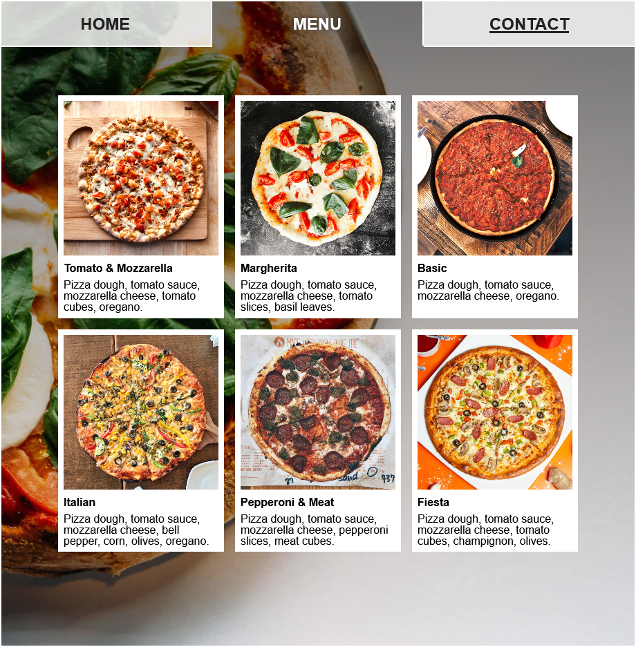

# La Pizzeria

> A restaurant page with tabbed navigation and plenty of JavaScript.




This project is intended to make use of JavaScript as the main tool for manipulating elements and content, as well as Webpack for module bundle. It makes use of:
- Content entirely generated by JavaScript
- Webpack to bundle modules and assets
- Modular programming with JavaScript ES6 Modules

## Built With

- HTML & CSS
- JavaScript
- Webpack

## Live Demo

[Take a look at a live demo of this app](https://brenoxav.github.com/restaurant)

## Getting Started

To get a local copy up and running follow these steps:

### Prerequisites

- A browser

### Setup

- Clone or download the project to your local machine

- Change to the project's root directory
```
restaurant
```

- Open the `index.html` file with your preferred browser
```
/dist/index.html
```

## Author

👨‍💻 **Breno Xavier**

- GitHub: [@brenoxav](https://github.com/brenoxav)
- Twitter: [@brenoxav](https://twitter.com/brenoxav)
- LinkedIn: [Breno Xavier](https://linkedin.com/in/brenoxav)

## Show your support

Give a ⭐️ if you like this project!

## Acknowledgments

- Microverse
- Odin Project
